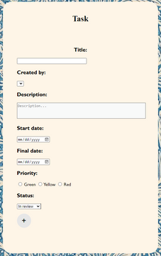
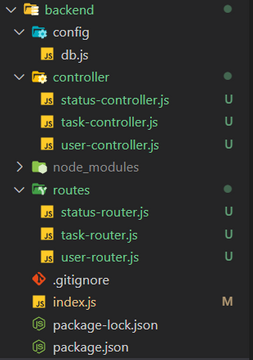
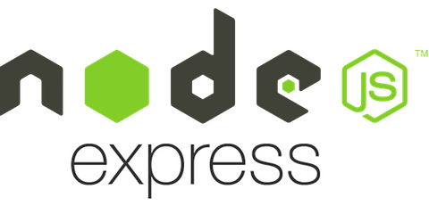
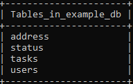

# Task

This repository contains the front-end and back-end of a web page that will be used to manage tasks.

## Front-end:

To create the front-end, html, css and javascript were used to make the page interactive, user-friendly and pleasing to the eye.

## Back-end:

To create the backend we use express.js and node.js so that the page can connect to the database.

## Database:

MySQL is used in order to have a database that allows us to consult and save task information.

